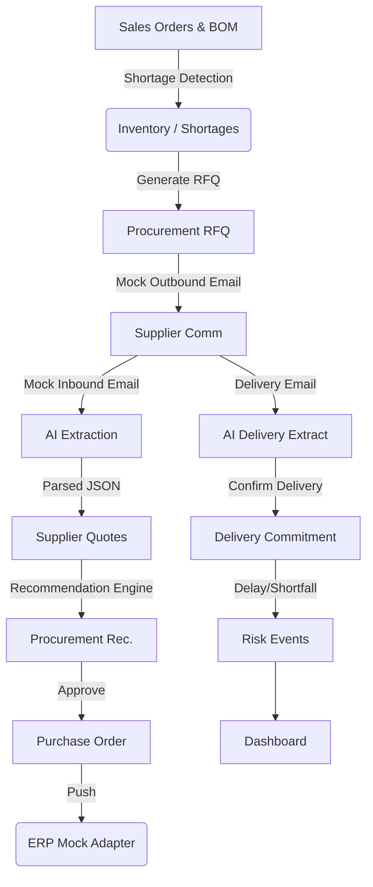

# ProcureAI Full-Stack Demo

ProcureAI is a smart procurement system designed to automate shortage detection, supplier quoting via LLM, and purchase order fulfillment.

## Architecture



## Setup & Running

1. **Copy Environment Variables**:
   ```bash
   cp .env.example .env
   # Add your ANTHROPIC_API_KEY to .env for AI features to work
   ```

2. **Start Services**:
   ```bash
   make setup
   # This will build images, start containers, run migrations, and seed the database.
   ```

3. **Access**:
   - Frontend: http://localhost:5173
   - Backend API: http://localhost:8000
   - API Docs: http://localhost:8000/docs

## End-to-End Demo via cURL

You can run through the complete flow to see how ProcureAI handles a shortage.

### 1. Identify Shortages
```bash
curl -X GET http://localhost:8000/shortages/
```
*Note the `material_id` for the material with a shortage (e.g., Aluminum Frame).*

### 2. Generate RFQ
```bash
curl -X POST http://localhost:8000/procurement/{material_id}/rfq \
  -H "Content-Type: application/json" \
  -d '{"quantity": 1000, "required_date": "2026-10-01"}'
```
*Note the returned `id` (this is the `rfq_id`).*

### 3. Simulate Inbound Quotes (Emails)
Send a few mock emails from suppliers quoting this RFQ.
```bash
curl -X POST http://localhost:8000/supplier-communications/mock-inbound \
  -H "Content-Type: application/json" \
  -d '{"rfq_id": "{rfq_id}", "supplier_id": "{supplier_1_id}", "raw_text": "We can supply 1000 units at $15 each. Lead time is 10 days."}'
```
*Note the `id` of the created communication.*

### 4. Extract Quotes via AI
```bash
curl -X POST http://localhost:8000/supplier-communications/{comm_id}/extract
```

### 5. Compare & Recommend
```bash
curl -X POST http://localhost:8000/rfqs/{rfq_id}/compare
```
*Note the `id` of the recommendation.*

### 6. Approve & Create PO
```bash
curl -X POST http://localhost:8000/recommendations/{recommendation_id}/approve
```
*Note the `id` of the created PO. It will also show the `erp_reference`.*

### 7. Confirm Delivery (Simulate Risk)
Supplier replies confirming a lower quantity or late delivery.
```bash
curl -X POST http://localhost:8000/purchase-orders/{po_id}/confirm-from-email \
  -H "Content-Type: application/json" \
  -d '{"raw_text": "We can only deliver 800 units, arriving on 2026-10-15."}'
```

### 8. View Risks & Dashboard
```bash
curl -X GET http://localhost:8000/purchase-orders/{po_id}/risk
curl -X GET http://localhost:8000/dashboard/summary
```
